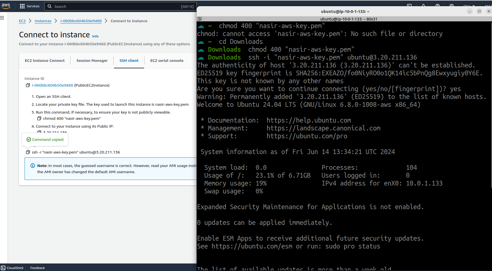

Task: Use Terraform to create a simple AWS infrastructure that includes:
• A VPC with two subnets (one public, one private)
• An EC2 instance in the public subnet
• An RDS instance in the private subnet
• A security group to allow SSH access to the EC2 instance and appropriate access to
the RDS instance.
---
**Answer**

**Steps 1: Install Terraform from official documents referenaces [References](https://developer.hashicorp.com/terraform/tutorials/aws-get-started/install-cli)**

**Steps 2: Use IAM credentials to authenticate the Terraform AWS provider**

**Steps 3: Setting Up AWS CLI Authentication**

**Steps 4: Terraform Infrastructure as Code (IaC) Documentation**

**Note: Terraform code can be organized further with main files (main.tf, variables.tf, outputs.tf), resource dependencies, and variable definitions.**

```hcl
# Define the AWS provider
provider "aws" {
  region = "us-east-2"
}

# Define a VPC
resource "aws_vpc" "aes_vpc" {
  cidr_block       = "10.0.0.0/16"
  instance_tenancy = "default"

  tags = {
    Name = "AES_VPC"
  }
}

# Create an Internet Gateway
resource "aws_internet_gateway" "aes_igw" {
  vpc_id = aws_vpc.aes_vpc.id

  tags = {
    Name = "AES_IGW"
  }
}

# Define a public subnet within the VPC
resource "aws_subnet" "public_subnet" {
  vpc_id            = aws_vpc.aes_vpc.id
  cidr_block        = "10.0.1.0/24"
  availability_zone = "us-east-2a"

  tags = {
    Name = "PublicSubnet"
  }
}

# Define a private subnet within the VPC in AZ us-east-2b
resource "aws_subnet" "private_subnet_1" {
  vpc_id            = aws_vpc.aes_vpc.id
  cidr_block        = "10.0.2.0/24"
  availability_zone = "us-east-2b"

  tags = {
    Name = "PrivateSubnet1"
  }
}

# Define a private subnet within the VPC in AZ us-east-2c
resource "aws_subnet" "private_subnet_2" {
  vpc_id            = aws_vpc.aes_vpc.id
  cidr_block        = "10.0.3.0/24"
  availability_zone = "us-east-2c"

  tags = {
    Name = "PrivateSubnet2"
  }
}

# Define a security group for SSH access to EC2 instances
resource "aws_security_group" "ec2_sg" {
  name        = "ec2-security-group"
  description = "Allow SSH access"
  vpc_id      = aws_vpc.aes_vpc.id

  ingress {
    from_port   = 22
    to_port     = 22
    protocol    = "tcp"
    cidr_blocks = ["0.0.0.0/0"]
  }

  egress {
    from_port   = 0
    to_port     = 0
    protocol    = "-1"
    cidr_blocks = ["0.0.0.0/0"]
  }

  tags = {
    Name = "ec2-security-group"
  }
}

# Define a security group for RDS access
resource "aws_security_group" "rds_sg" {
  name        = "rds-security-group"
  description = "Allow access to RDS"
  vpc_id      = aws_vpc.aes_vpc.id

  ingress {
    from_port       = 3306
    to_port         = 3306
    protocol        = "tcp"
    security_groups = [aws_security_group.ec2_sg.id]  # Allow access from EC2 SG
  }

  egress {
    from_port   = 0
    to_port     = 0
    protocol    = "-1"
    cidr_blocks = ["0.0.0.0/0"]
  }

  tags = {
    Name = "rds-security-group"
  }
}

# Create a public route table and associate it with the public subnet
resource "aws_route_table" "public_route_table" {
  vpc_id = aws_vpc.aes_vpc.id

  route {
    cidr_block = "0.0.0.0/0"
    gateway_id = aws_internet_gateway.aes_igw.id
  }

  tags = {
    Name = "PublicRouteTable"
  }
}

resource "aws_route_table_association" "public_subnet_association" {
  subnet_id      = aws_subnet.public_subnet.id
  route_table_id = aws_route_table.public_route_table.id
}

# Define a DB Subnet Group
resource "aws_db_subnet_group" "db_subnet_group" {
  name       = "rds-subnet-group"
  subnet_ids = [aws_subnet.private_subnet_1.id, aws_subnet.private_subnet_2.id]  # Include both private subnets

  tags = {
    Name = "RDSSubnetGroup"
  }
}

# Define an RDS instance in the private subnet
resource "aws_db_instance" "rds_instance" {
  identifier             = "mydbinstance"
  allocated_storage      = 20
  storage_type           = "gp2"
  engine                 = "mysql"
  engine_version         = "8.0"
  instance_class         = "db.t3.micro"
  db_name                = "eticket"
  username               = "admin"
  password               = "Pass4You"
  db_subnet_group_name   = aws_db_subnet_group.db_subnet_group.name
  vpc_security_group_ids = [aws_security_group.rds_sg.id]
  skip_final_snapshot    = true

  tags = {
    Name = "RDSInstance"
  }
}

# Define an EC2 instance in the public subnet
resource "aws_instance" "public_instance" {
  ami             = "ami-09040d770ffe2224f"  #Ubuntu 24.04 LTS AMI ID
  key_name        = "nasir-aws-key"
  instance_type   = "t2.micro"
  subnet_id       = aws_subnet.public_subnet.id
  security_groups = [aws_security_group.ec2_sg.id]

  tags = {
    Name = "PublicEC2Instance"
  }
}
```


**Step 5: Provision a Public IP and attach it to an EC2 Instance for SSH access and DB connectivity testing**


**Step 5.1: ssh to EC2 Instance and install mysql-client and connect with Database**

<p align="center">
  
  <br/>
  Pic: Connect with EC2 via ssh key
</p>


```bash
sudo apt-get update
sudo apt-get install mysql-client

mysql -h mydbinstance.c7qqs8smk06u.us-east-2.rds.amazonaws.com -P 3306 -u admin -p
```

Provide the database password and verify the DB connection from the EC2 instance.
